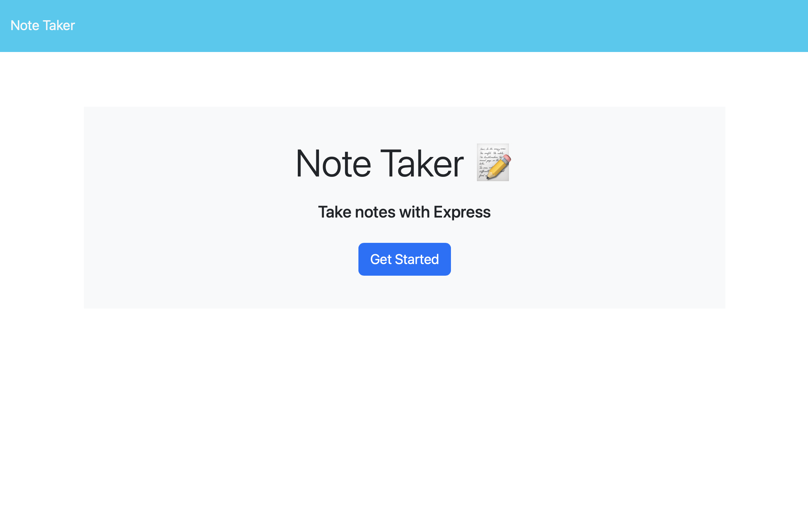
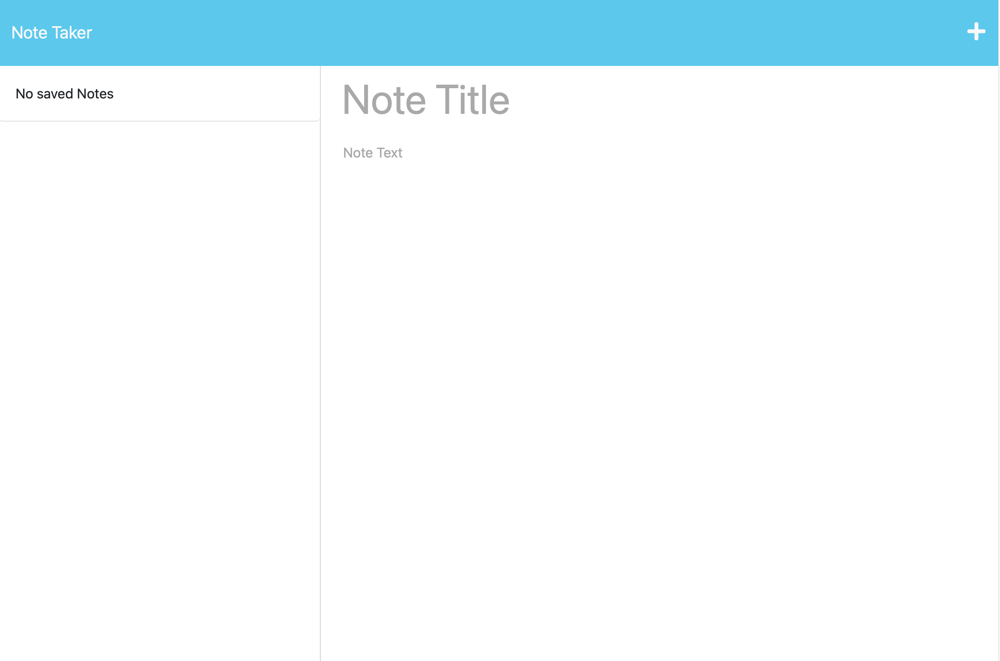
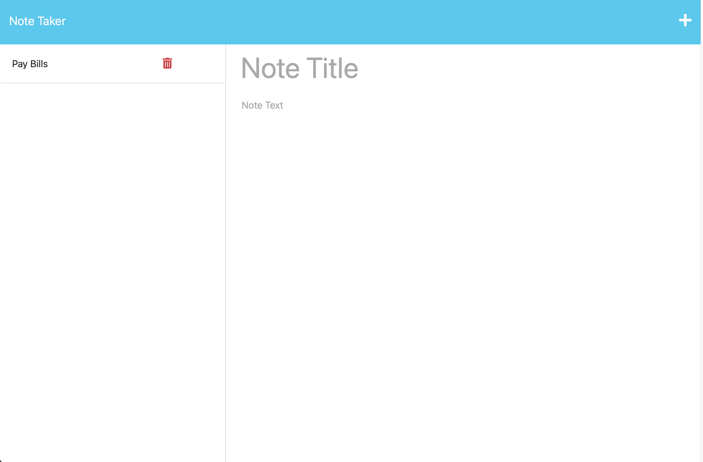
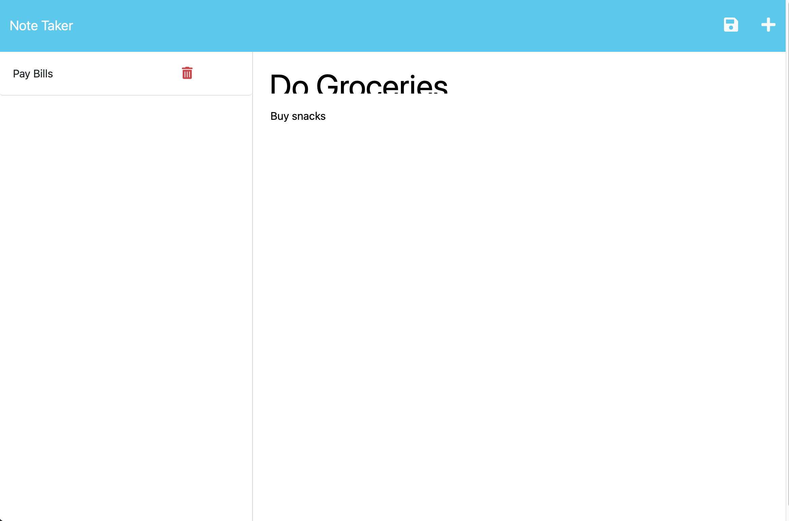

# Note-Taker

## Description:
This app allows the user to read and write notes. The app uses Express.js and Node.js to connect to client-server and back-end server

## Table of content:
1. [Installation](#installation)
2. [Usage](#usage)
3. [Username](#username)
4. [Email](#email)

## Installation:
1. Deploy the webapp with the following link [Note Taker App by Heroku](https://afunnotetakerapp.herokuapp.com/)
2. Add a title to your note 
3. Click on the save icon to save your note
4. Click on the plus icon to add new notes
5. If a note needs to be deleted, click the trash icon next to the notes title to discard the note

## Usage:

## Github Username:
  https://github.com/darioelaoao

## Email:
  darioelao@gmail.com